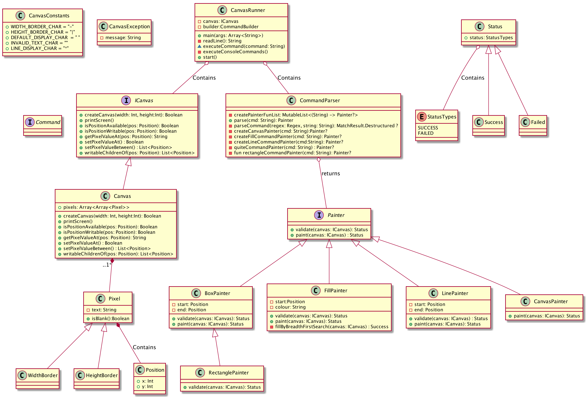

# Canvas Drawing

This Solution is to implement console based canvas drawing application.

## Problem Statement

### Description

You're given the task of writing a simple console version of a drawing program. 
At this time, the functionality of the program is quite limited but this might change in the future. 
In a nutshell, the program should work as follows:
 1. Create a new canvas
 2. Start drawing on the canvas by issuing various commands
 3. Quit


Command 		Description
C w h           Should create a new canvas of width w and height h.
L x1 y1 x2 y2   Should create a new line from (x1,y1) to (x2,y2). Currently only
                horizontal or vertical lines are supported. Horizontal and vertical lines
                will be drawn using the 'x' character.
R x1 y1 x2 y2   Should create a new rectangle, whose upper left corner is (x1,y1) and
                lower right corner is (x2,y2). Horizontal and vertical lines will be drawn
                using the 'x' character.
B x y c         Should fill the entire area connected to (x,y) with "colour" c. The
                behavior of this is the same as that of the "bucket fill" tool in paint
                programs.
Q               Should quit the program.

__Sample I/O__

Below is a sample run of the program. User input is prefixed with enter command:
```
enter command: C 20 4
----------------------
|                    |
|                    |
|                    |
|                    |
----------------------

enter command: L 1 2 6 2
----------------------
|                    |
|xxxxxx              |
|                    |
|                    |
----------------------

enter command: L 6 3 6 4
----------------------
|                    |
|xxxxxx              |
|     x              |
|     x              |
----------------------

enter command: R 14 1 18 3
----------------------
|             xxxxx  |
|xxxxxx       x   x  |
|     x       xxxxx  |
|     x              |
----------------------

enter command: B 10 3 o
----------------------
|oooooooooooooxxxxxoo|
|xxxxxxooooooox   xoo|
|     xoooooooxxxxxoo|
|     xoooooooooooooo|
----------------------

enter command: Q
```

## Requirement

* Internet
* Java 1.8 or above

## Build

Application is build and packaged using Gradle 4.10.3 build System.

### Setup
 
 Execute the below command to build and setup executable jar file
 
 ```bash
    cd $projecDir
    ./gradlew clean test jar
```

<span style="color:red"><small><i>Note : In order to run behind proxy, update proxy configuration in gradle.properties under $projectDir</i></small></span>

Below activities are performed during build:

* Cleans the build folder `$projectDir/build`
* Compiles Source code
* Executes unit test cases
* bundles the executable jar file in location `$projectDir/build/libs/Drawing-1.0-SNAPSHOT.jar`

### Logging

Execution log files are created in the location `$projectDir/build/libs/logs`

## Design

### Class Overview

|Package| Class Name | Brief Intro|
|-------|------------|------------|
|org.draw.paint|CanvasRunner| **Entry Point**.It reads the console command and executes them.|
|org.draw.paint.command|CommandBuilder|Helps to build command class from a string console command|
|org.draw.paint.command|CommandParser| Base Class for all command parsers|
|org.draw.paint.command|CreateCanvasCommandParser|Helps to match a command string; Parse the command string and creates CreateCanvasCommand object|
|org.draw.paint.command|FillCommandParser|Helps to match a command string; Parse the command string and creates FillCommand object|
|org.draw.paint.command|LineCommandParser|Helps to match a command string; Parse the command string and creates LineCommand object|
|org.draw.paint.command|QuitCommandParser|Helps to match a command string; Parse the command string and creates QuitCommand object|
|org.draw.paint.command|RectangleCommandParser|Helps to match a command string; Parse the command string and creates RectangleCommand object|
|org.draw.paint.command|Command|Base interface for all commands|
|org.draw.paint.command|CreateCanvasCommand|Creates Canvas with the given width and heigh|
|org.draw.paint.command|FillCommand|Fills Closed area in the canvas with  the given colour|
|org.draw.paint.command|LineCommand|Draws a line from given start to end positions|
|org.draw.paint.command|QuitCommand|Quits the execution.|
|org.draw.paint.command|RectangleCommand|Draws a Rectangle with given start and end positions|
|org.draw.paint.painter|Painter|Base for all painters|
|org.draw.paint.painter|BoxPainter|Painter to draw a Box in the canvas|
|org.draw.paint.painter|FillPainter|Painter to Fill closed area in the canvas with given color|
|org.draw.paint.painter|LinePainter|Painter to draw a line in the canvas|
|org.draw.paint.painter|RectanglePainter|Painter to draw a rectangle in the canvas|
|org.draw.paint.canvas|ICanvas|Base for all Canvas|
|org.draw.paint.canvas|Canvas|Area with the given width and Height that holds drawing|
|org.draw.paint.canvas|Pixel|Tiny part of Canvas which hold the draw value.|
|org.draw.paint.canvas|CanvasHolder|Class that receives the painter and draws on the canvas|
|org.draw.paint.canvas|CanvasConstants|Canvas Constants|

### Class Diagram Overview

---
